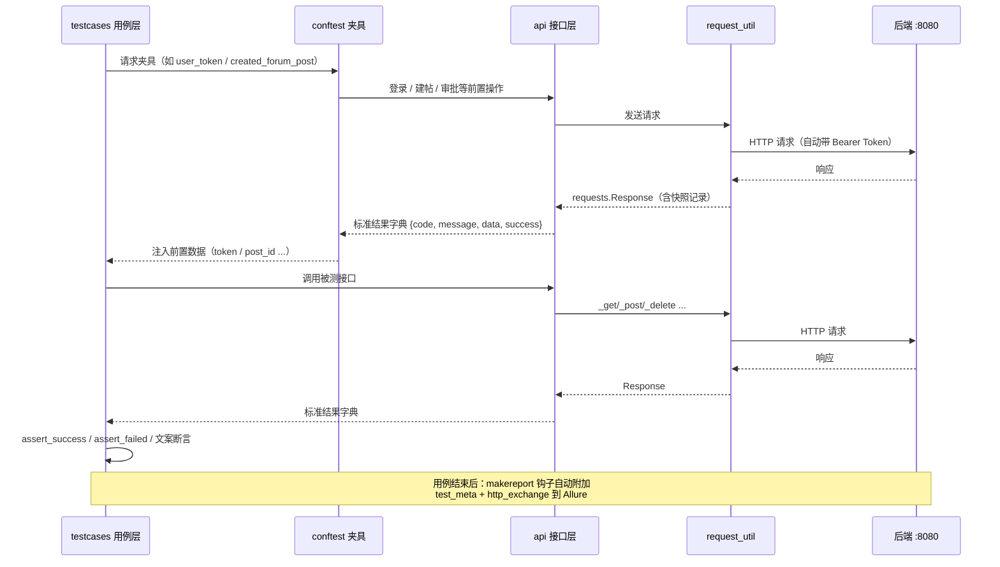

# 接口自动化测试框架架构设计文档

> 适用范围：`pycharm/` 目录下的接口自动化测试框架
> 被测系统：校园服务类系统后端（Spring Boot，`http://localhost:8080`）
> 技术栈：Python 3.11 · pytest · requests · allure-pytest · Faker · loguru

---

## 1. 框架概述

本框架针对后端 REST API 进行自动化验证，覆盖 **用户、论坛、即时消息、失物招领、新闻、首页** 六大业务模块。框架采用经典的分层设计：用例层只关心业务断言，接口层负责协议封装，工具层承接 HTTP 通信与鉴权，配置层集中管理环境参数，实现"一套框架、按模块扩展"的可维护结构。

核心设计目标：

| 目标 | 实现手段 |
|---|---|
| 用例与实现分离 | 用例层不出现 URL/请求细节，只调用 API 封装层 |
| 结果判定统一 | 业务码 `code == 200` 判成功，与 HTTP 状态码解耦 |
| 失败可追溯 | 每条用例自动附加请求/响应快照到 Allure 报告 |
| 数据驱动 | testdata 参数化数据 + Faker 随机唯一数据 |
| 环境可切换 | 配置全部支持环境变量覆盖 |

---

## 2. 总体架构

```
┌──────────────────────────────────────────────────────────┐
│  用例层 testcases/                                        │
│  test_user / test_forum / test_im / test_lostfound        │
│  test_news / test_home      （业务断言，不碰 HTTP 细节）    │
└───────────────▲──────────────────────────────────────────┘
                │ 调用
┌───────────────┴───────────────┐   ┌──────────────────────┐
│  接口封装层 api/                │   │  数据与夹具层          │
│  base_api.py（统一响应处理）     │   │  testdata/user_cases  │
│  user/forum/im/lostfound/     │◄──┤  conftest + fixtures/ │
│  news/home                    │   │  pytest.ini 标记       │
└───────────────┬───────────────┘   └──────────────────────┘
                │ 发送请求
┌───────────────┴───────────────┐
│  工具层 utils/                  │
│  request_util（请求引擎/Token） │◄──┐
│  auth_util（登录鉴权）          │   │
│  data_util（数据生成）          │   │ 读取
│  test_context（共享常量）       │   │
└───────────────┬───────────────┘   │
                │ HTTP              │
┌───────────────┴───────────────┐   │
│  被测系统 Spring Boot :8080    │   │
└───────────────────────────────┘   │
                          ┌─────────┴───────┐
                          │ 配置层 config/    │
                          │ config.py        │
                          └─────────────────┘
```

### 2.1 目录结构

```
pycharm/
├── pytest.ini              # pytest 运行配置（目录、命名、marker、Allure 输出）
├── conftest.py             # 全局断言助手 + 会话级登录态 + autouse 夹具 + 报告 hook
├── requirements.txt        # 依赖清单
├── fixtures/               # 业务夹具包（按模块拆分，由 conftest 通过 pytest_plugins 注册）
│   ├── helpers.py          # 跨模块断言助手与唯一数据构造工具
│   ├── user_fixtures.py    # 用户模块夹具（注册/登录数据、动态用户、上传文件）
│   ├── forum_fixtures.py   # 论坛模块夹具（版块、发帖、审核）
│   ├── lostfound_fixtures.py # 失物招领模块夹具（招领数据、审核）
│   ├── news_fixtures.py    # 新闻模块夹具（新闻数据、已发布新闻）
│   └── im_fixtures.py      # 即时消息模块夹具
├── config/
│   └── config.py           # 配置层：环境配置（URL、账号、超时）
├── api/
│   ├── base_api.py         # 接口基类：统一响应模型 + 通用请求方法
│   ├── user_api.py         # 用户模块接口封装
│   ├── forum_api.py        # 论坛模块接口封装
│   ├── im_api.py           # 即时消息模块接口封装
│   ├── lostfound_api.py    # 失物招领模块接口封装
│   ├── news_api.py         # 新闻模块接口封装
│   └── home_api.py         # 首页模块接口封装
├── utils/
│   ├── request_util.py     # HTTP 请求引擎（Session、Token 注入、快照记录）
│   ├── auth_util.py        # 登录鉴权工具
│   ├── data_util.py        # 测试数据生成（Faker）
│   └── test_context.py     # 共享常量（账号、目标用户 ID）
├── testdata/
│   └── user_cases.py       # 参数化用例数据（与用例文档编号一一对应）
├── testcases/
│   ├── test_user.py        # 用户模块用例
│   ├── test_forum.py       # 论坛模块用例
│   ├── test_im.py          # 即时消息模块用例
│   ├── test_lostfound.py   # 失物招领模块用例
│   ├── test_news.py        # 新闻模块用例
│   └── test_home.py        # 首页模块用例
└── report/                 # Allure 原始结果 + HTML 报告输出目录
```

---

## 3. 分层详细设计

### 3.1 配置层 config/

`config/config.py` 使用 frozen dataclass 定义只读配置，所有字段支持环境变量覆盖，模块末尾导出全局单例 `config`：

| 配置项 | 环境变量 | 默认值 |
|---|---|---|
| base_url | BASE_URL | http://localhost:8080 |
| admin_username / admin_password | ADMIN_USERNAME / ADMIN_PASSWORD | admin / 123456 |
| test_user_username / test_user_password | TEST_USER_USERNAME / TEST_USER_PASSWORD | stu_zhang / 123456 |
| timeout | TIMEOUT | 10 |
| max_retries | MAX_RETRIES | 3 |

### 3.2 工具层 utils/

| 模块 | 职责 | 关键设计 |
|---|---|---|
| request_util | HTTP 请求引擎 | 基于 `requests.Session` 复用连接；自动拼接 base_url；`set_token` 自动补 `Bearer ` 前缀；每次请求/响应生成快照（`last_request`/`last_response`）供报告取证；日志与快照中对 Authorization 头**脱敏**（仅显示前 10 后 6 位） |
| auth_util | 登录鉴权 | `login` 使用 `account` 字段（支持用户名/学号/手机号）；登录成功自动将 Token 写入请求头；提供 `admin_login`/`user_login`/`ensure_login`/`is_admin` |
| data_util | 测试数据生成 | Faker(zh_CN) 生成用户名、手机号、邮箱、标题、内容；内置 1×1 合法 PNG 字节（`PNG_BYTES`）供上传类用例；`generate_unique_id` 基于"毫秒时间戳+随机数"保证数据唯一性 |
| test_context | 共享常量 | 管理员账号、普通用户账号、目标用户 ID，供 fixture 与用例引用 |

### 3.3 接口封装层 api/

- **base_api.py**：所有模块 API 的父类，核心方法 `_handle_response` 将原始响应统一转换为标准结果字典：

```python
{
    "status_code": ...,  # HTTP 状态码
    "code": ...,         # 业务码（成功为 200）
    "message": ...,      # 业务提示
    "data": ...,         # 业务数据
    "success": ...,      # code == 200 判定，与 HTTP 状态码解耦
    "raw": ...,          # 原始响应（兜底排查用）
}
```

  同时提供 `_get / _post / _put / _delete / _patch / _post_files` 六个通用请求方法，子类无需重复处理响应解析；响应非 JSON 时自动降级并记录 raw 文本。

- **6 个模块 API**：每个后端接口对应一个方法，只负责"组装参数 + 指定路径"，不含断言逻辑。以 `user_api.py` 为例，覆盖注册、登录、资料修改、改密、封禁/解封、头像与文件上传等 20+ 接口。

### 3.4 数据层 testdata/ + conftest 夹具

- **testdata/user_cases.py**：参数化用例数据（REGISTER_CASES、LOGIN_CASES），每条数据包含：用例编号（USER-001~013）、输入构造方式（`account_mode`/`password_mode`）、预期结果（`expected_success`/`expected_code`）、预期文案（`expected_message_contains`），与《接口测试用例》文档编号一一对应，保证"文档—代码"双向可追溯。
- **conftest.py + fixtures/ 夹具体系**：断言助手与会话级登录态保留在 conftest.py（断言助手定义于 `fixtures/helpers.py` 并由 conftest 再导出，保持 `from conftest import ...` 用法兼容），业务夹具按模块拆分在 fixtures/ 包：

| 类别 | 代表夹具 | 作用域 |
|---|---|---|
| 断言助手 | `assert_success` / `assert_failed` / `assert_text_contains` / `result_text` | 普通函数（业务提示兼容 message 与 data 两个位置） |
| 登录态 | `admin_token` / `user_token` / `extra_user` / `extra_user_token` | session（会话内只登录一次） |
| 业务前置数据 | `forum_category_id`、`created_forum_post`、`approved_forum_post_id`、`created_lost_found`、`published_news_id`、`upload_file_factory` | session / function |
| 动态注册数据 | `register_data`、`login_user_data`、`created_login_user` | function（每条用例独立唯一） |
| 环境检查 | `setup_session`（后端不通直接 skip 整个 session）、`setup_function`（每条用例前后清理请求头） | autouse |

### 3.5 用例层 testcases/

6 个测试文件对应 6 个业务模块，命名与组织规则：

- 类级 `@allure.feature("模块名")` 打标，函数级 `@pytest.mark.模块` / `@pytest.mark.p0` 优先级标记（marker 在 pytest.ini 注册）；
- 参数化用例：`@pytest.mark.parametrize` 驱动 testdata 数据，`ids` 使用文档用例编号；
- 后端实际行为与用例文档不符时，以 `pytest.skip("原因")` 显式注明（如注册接口未实现字段长度校验）；
- 已知后端缺陷用例以 `pytest.xfail` 记录（如逻辑删除后的详情查询仍返回 200）。

### 3.6 报告与运行配置

- **pytest.ini**：指定用例目录/命名规则、`--alluredir=./report/allure --clean-alluredir`，注册 user/lostfound/forum/im/news/home/upload/admin/smoke/p0/p1/p2 等 marker；
- **conftest 钩子** `pytest_runtest_makereport`：每条用例执行后自动附加 `test_meta`（用例名/结果/耗时）与 `http_exchange`（脱敏后的最近请求/响应快照）到 Allure；失败用例额外附加异常堆栈；
- **report/**：Allure 原始结果目录，经 `allure generate` 生成 HTML 报告。

---

## 4. 用例执行链路

### 4.1 调用链（以注册用例为例）

```python
testcases/test_user.py::test_register_cases          # 用例层：取参数化数据、调 API、断言
  → api/user_api.py::register(...)                   # 接口层：组装 payload、选择路径
    → api/base_api.py::_post(...)                    # 统一响应处理
      → utils/request_util.py::post(...)             # 工具层：补全 URL、注入 Token、记录快照
        → http://localhost:8080/api/user/register    # 被测系统
```

### 4.2 时序图



### 4.3 夹具执行顺序

1. **session 级**：`setup_session` 探测后端连通性（不通则整个 session skip）→ `admin_token` / `user_token` 按需登录一次；
2. **session 级业务前置**：`forum_category_id`、`published_news_id` 等仅准备一次；
3. **function 级**：`setup_function` 清理请求头 → 数据夹具（如 `register_data`）生成唯一数据 → 业务夹具（如 `created_forum_post`）调用接口造数 → 用例执行 → `setup_function` 再次清理请求头；
4. **钩子收尾**：无论成败，附加测试元数据与 HTTP 交互快照到报告。

### 4.4 双账号场景机制

对于"非作者操作""非接收方"等需要双角色的场景，`extra_user` 夹具（session 级）动态注册一个临时普通用户并登录，返回 `{id, username, password, token}`，配合 `extra_user_token` 夹具实现同一用例内的身份切换（切换时通过 `request_util.set_token` / `clear_headers` 保证请求头隔离）。

---

## 5. 关键机制设计

| 机制 | 说明 |
|---|---|
| 统一响应模型 | base_api 将所有响应归一为 `{status_code, code, message, data, success, raw}`，业务成败以 `code == 200` 判定 |
| Token 管理与脱敏 | `set_token` 统一补 `Bearer ` 前缀；快照与日志中 Authorization 头脱敏，报告不泄露凭据 |
| 环境前置检查 | session 开始时对后端做 TCP 探测，后端不可用时 skip 全部用例并注明原因，避免大量无意义失败 |
| 失败自动取证 | 每条用例自动附加最近一次 HTTP 交互（已脱敏），失败时附加异常信息，报告即可定位问题 |
| 数据唯一性 | 注册/发帖等写操作数据由"时间戳+随机数+计数"生成，支持重复执行不冲突 |
| 文案兼容断言 | `result_text` 拼接 message 与 data 字段，兼容后端把业务提示放在 data 的接口 |
| 缺陷显式记录 | 与文档不符的实际行为用 skip+原因、已知缺陷用 xfail，保证报告可解释 |

---

## 6. 运行方式

```bash
# 安装依赖
pip install -r requirements.txt

# 运行全部用例（需后端已启动在 localhost:8080）
pytest

# 按模块/标记运行
pytest -m user
pytest -m "p0"

# 生成并打开 Allure 报告
allure serve report/allure
```

---

## 7. 扩展指引

新增一个业务模块的步骤：

1. `api/` 下新建 `xxx_api.py`，继承 `BaseAPI`，为每个接口写一个方法；
2. `testcases/` 下新建 `test_xxx.py`，类打 `@allure.feature`，用例打 marker；
3. 需要参数化的数据放入 `testdata/xxx_cases.py`；
4. 需要前置数据时在 `fixtures/` 对应模块文件中增加夹具（注意作用域选择 session/function）；新增业务模块时同步新建 `fixtures/xxx_fixtures.py` 并在 conftest.py 的 `pytest_plugins` 中注册；
5. 若引入新 marker，在 `pytest.ini` 注册。
